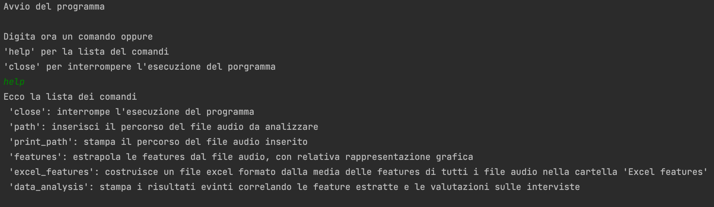
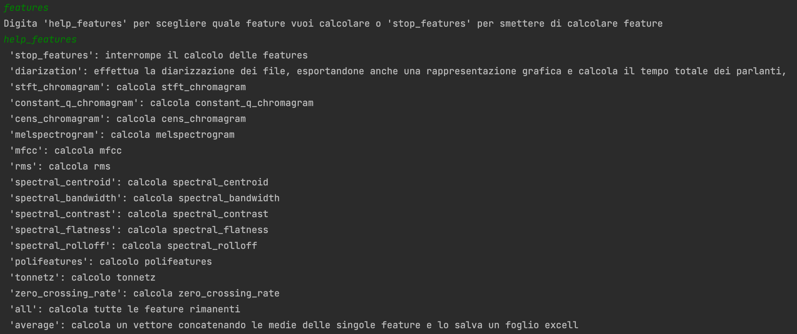

# Speech analysis

## Overview
Lo scopo di tale progetto è quello di trovare delle correlazioni, a partire da 
delle interviste, tra il giudizio espresso da intervistati ed intervistatori 
sulla qualità di quest'ultime, e le features estrapolate dai relativi file audio .wav .

## Implementazione

Le classi che compongono tale progetto sono le seguenti:
1. La classe **Main**, principale classe del programma, dalla quale è possibile
selezionare i possibili comandi
2. La classe **AudioManipulation**, la quale ha il compito di estrapolare 
le feature di un file audio
3. La classe **DataAnalysis**, tramite la quale calcolare le correlazioni
tra le feature estratte e i relativi questionari.

Basta eseguire la classe **Main** per gestire il programma attraverso 
il terminale, o digitare _help_ per visualizzare tutti i possibili comandi



Il programma si divide logicamente in due parti: una prima, volta a estrapolare 
le feature relative ai file audio; una seconda, volta a trovare delle correlazioni
tra le feature estrapolate e i questionari che rappresentano la qualità 
delle interviste.

### Estrazione manuale delle feature

È possibile calcolare le feature di un singolo file audio nella seguente maniera:
1. Digitare il comando _path_ ed inserire il percorso del file audio 
(relativo se si trova nella stessa cartella o assoluto se altrove)
2. Digitare il comando _features_, ed eventualmente il comando _help_features_,
rispettivamente per aprire il sottomenù delle possibili funzioni per l'analisi 
dei file audio e per visualizzarne l'elenco



È possibile calcolare le feature una alla volta, inserendo il comando
relativo, o tutte insieme attraverso il comando _all_.\
Per ogni feature verrà inoltre esportata un'immagine che ne rappresenta il 
risultato all'interno di un grafico. Tutti i grafici sono contenuti e catalogati all'interno della
cartella _Visualization_ (si crea automaticamente se non esiste).\

Particolare è il funzionamento del comando _diarization_, il quale ha il compito di esportare
la diarizzazione dei file audio. 
All'interno della cartella _Speaker_ (si crea automaticamente se non esiste) vengono
infatti inseriti i file audio divisi in cartelle 
(ciascuna cartella conterrà tutte e solo le frasi espresse da uno dei due parlanti) 
ed una visualizzazione grafica dei momenti in cui i parlanti interagiscono per tutta l'intervista.
Tale feature verrà rappresentata nel dataset esportando il tempo di interazione dei due parlanti
all'interno dell'invervista

È bene poi sottolineare che il responsabile dell'esportazione
del **vettore** che rappresenta le feature 
associate ad un file audio è il comando _average_.
Il funzionamento di tale comando si compone dei seguenti passagi:
1. Controlla se tutte le feature sono già state calcolate (in alternativa
chiede di digitare prima il comando _all_).
2. Dal momento che ogni feature è rappresentata da una matrice, o più precisamente
da una lista di liste, viene calcolata e concatenata 
in un vettore la media di ogni singola lista  
3. Vengono concatenati tutti i vettori che rappresentano le feature ed esportati
all'interno di un file excel denominato "features.xlsx",
contenuto a sua volta all'interno della cartella _Excel features_ 
(la cartella verrà creata automaticamente se non esiste ancora).

Rispetto all'esportazione delle feature è bene precisare che:
1. Ogni file audio è identificato da una riga che ne rappresenta il nome e le componenti
delle feature
2. Nel caso in cui il file "features.xlsx" esiste già, gli viene semplicemente aggiunta
una riga.
3. L'ordine con il quale tali componenti vengono esportate è lo stesso per ogni file
audio, così da poter visualizzare, per ogni colonna, il rispettivo 
valore di una feature per ogni intervista. Tale è il motivo per il quale prima del
comando _average_ risulta fondamentale calcolare il comando _all_.

### Estrazione automatica delle feature

In alternativa è possibile automatizzare il processo creando una cartella
denominata _Interviews_ nel percorso corrente, ed inserire tutte le interviste
da analizzare nella stessa.
In seguito a ciò basta eseguire la classe **Main** e digitare il comando 
_excel_features_ 

### Calcolo delle correlazioni tra i dati

Per mostrare il calcolo delle correlazioni tra i questionari somministrati agli intervistati
e agli intervistatori sulla qualità delle interviste, e le feature estrapolate
dai relativi file audio, è necessario, una volta eseguita la classe **Main**
digitare il comando _data_analysis_.
Per il funzionamento di tale script risulta necessario importare nel path corrente
la cartella _Analysis dataset_ qui fornita.\
Tale comando ha il compito di calcolare la **correlazione lineare** tra ogni colonna
del dataset delle feature estrapolate dai file audio (ogni colonna rappresenta
l'i-esima feature di tutti i file audio analizzati) e ogni colonna del dataset 
relativo ai questionari di valutazione (ogni colonna di tale dataset rappresenta
le risposte di tutti gli intervistati ed intervistatori alla stessa domanda).\
Tale correlazione lineare è stata calcolata prima dividendo le interviste in due sottogruppi
(denominati _A1A2_, _B1B2_), poi per l'intero dataset.\
Le correlazioni sono state calcolate a partire da diverse 
versioni di tali questionari di valutazione:
1. Una versione integrale, contenente tutte le domande di intervistati ed intervistatori
2. Una versione contenente tutte le domande ma solamente con le 
risposte degli intervistati
3. Una versione contenente un sottoinsieme delle domande
4. Una versione contenente un sottoinsieme delle domande 
ma solamente con le risposte degli intervistati

Tale script mostrerà sul terminale solamente le correlazioni con indice _rho_ maggiore
di 0.4 o minore di -0.4, ed il suo relativo _p-value_.


## Librerie esterne

Il programma è stato creato all'interno di un'ambiente di sviluppo di Anaconda.
È la libreria _pyannote_ a gestire il processo di diarizzazione dei file audio

```python
conda create -n pyannote python=3.8
conda activate pyannote

# pytorch 1.11 is required for speechbrain compatibility
# (see https://pytorch.org/get-started/previous-versions/#v1110)
conda install pytorch==1.11.0 torchvision==0.12.0 torchaudio==0.11.0 -c pytorch

pip install pyannote.audio
```

Quest'ultimo si avvale inoltre dell'utilizzo delle seguenti librerie:
1. _openpyxl_ per interagire con i dataset di excel
2. _librosa_ e  _numpy_ per il calcolo delle feature
3. _scipy_ per il calcolo delle correlazioni 
4. _pandas_ per la costruzione di dataframe
5. _pydub_ per l'esportazione dei file audio segmentati
6. _matplotlib_ per la creazione dei grafici associati alle feature estratte


