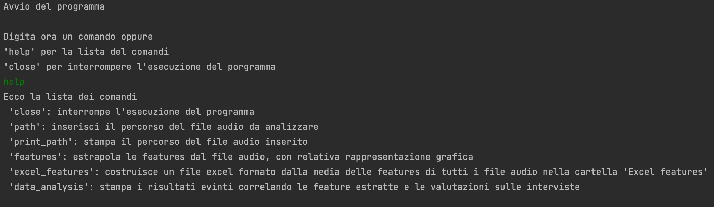
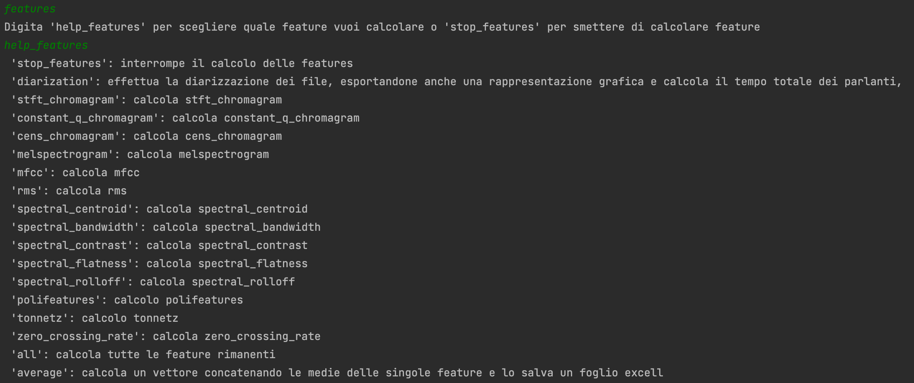

# Speech analysis

## Overview
The purpose of this project is to find correlations, starting from interviews between the judgment expressed by interviewees and interviewers on the quality of the latter, and the features extracted from the relative .wav audio files

## Implementazione

The classes that make up this project are the following:
-The **Main** class, the main class of the program, from which it is possible to select the available commands
-The **AudioManipulation** class, which has the task of extracting features from an audio file
-The **DataAnalysis** class, through which to calculate the correlations between the extracted features and the relative questionnaires.

Simply run the **Main** class to manage the program through the terminal, or type _help_ to view all possible commands.



The program is logically divided into two parts: a first one, aimed at extracting the features related to the audio files; a second one, aimed at finding correlations between the extracted features and the questionnaires representing the quality of the interviews.

### Manual feature extraction

It is possible to calculate the features of a single audio file in the following manner:
-Type the command path and enter the path of the audio file (relative if it is in the same folder or absolute if elsewhere)
-Type the command features, and eventually the command help_features, respectively to open the submenu of possible functions for audio file analysis and to view the list




It is possible to calculate features one at a time by entering the relative command, or all at once using the all command.
For each feature, an image representing the result within a graph will also be exported. All graphs are contained and categorized within the Visualization folder (which is created automatically if it does not exist).


The operation of the diarization command is unique, as it is responsible for exporting the diarization of the audio files.
Inside the Speaker folder (created automatically if it does not exist), the audio files are placed into separate folders (each folder will contain all and only the sentences spoken by one of the two speakers), along with a graphical visualization of the moments in which the speakers interact throughout the interview. This feature will be represented in the dataset by exporting the interaction time of the two speakers during the interview.

It is also worth noting that the command responsible for exporting the vector representing the features associated with an audio file is the average command.

The operation of this command consists of the following steps:
- It checks if all features have already been calculated (otherwise, it asks to type the all command first).
- Since each feature is represented by a matrix, or more precisely by a list of lists, the average of each individual list is calculated and concatenated into a vector.
- All the vectors representing the features are concatenated and exported into an Excel file named "features.xlsx", which is in turn contained within the Excel features folder (the folder will be created automatically if it does not yet exist).


Regarding the feature export, it is important to specify that:
- Each audio file is identified by a row representing its name and the feature components.
- If the "features.xlsx" file already exists, a row is simply added to it.
- The order in which these components are exported is the same for every audio file, so that for each column, the respective feature value for each interview can be viewed. This is why it is fundamental to run the all command before the average command.


### Automatic feature extraction

Alternatively, it is possible to automate the process by creating a folder named _Interviews_ in the current path and placing all the interviews to be analyzed within it.
Following this, simply run the **Main** class and type the command _excel_features_.

### Calculation of data correlations

To show the calculation of the correlations between the questionnaires administered to the interviewees and interviewers regarding the quality of the interviews, and the features extracted from the relative audio files, it is necessary—once the Main class is running—to type the command data_analysis.
For this script to function, it is necessary to import the provided Analysis dataset folder into the current path.
This command is responsible for calculating the linear correlation between each column of the dataset of features extracted from the audio files (each column represents the i-th feature of all analyzed audio files) and each column of the dataset related to the evaluation questionnaires (each column of this dataset represents the responses of all interviewees and interviewers to the same question).
This linear correlation was calculated first by dividing the interviews into two subgroups (named A1A2, B1B2), and then for the entire dataset.
The correlations were calculated starting from different versions of these evaluation questionnaires:
- A full version, containing all questions from both interviewees and interviewers
- A version containing all questions but only with the responses from the interviewees
- A version containing a subset of the questions
- A version containing a subset of the questions but only with the responses from the interviewees
This script will display on the terminal only the correlations with a rho index greater than 0.4 or less than -0.4, along with its relative p-value.


## External libraries

The program was created within an Anaconda development environment.
The pyannote library manages the diarization process of the audio files:

```python
conda create -n pyannote python=3.8
conda activate pyannote

# pytorch 1.11 is required for speechbrain compatibility
# (see https://pytorch.org/get-started/previous-versions/#v1110)
conda install pytorch==1.11.0 torchvision==0.12.0 torchaudio==0.11.0 -c pytorch

pip install pyannote.audio
```

The latter also makes use of the following libraries:
- openpyxl to interact with Excel datasets
- librosa and numpy for feature calculation
- scipy for correlation calculation
- pandas for dataframe construction
- pydub for exporting segmented audio files
- matplotlib for creating graphs associated with the extracted features


